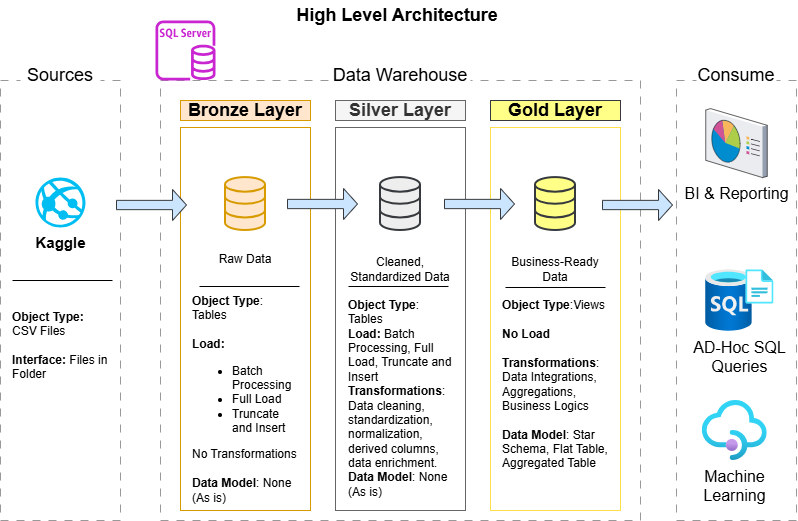
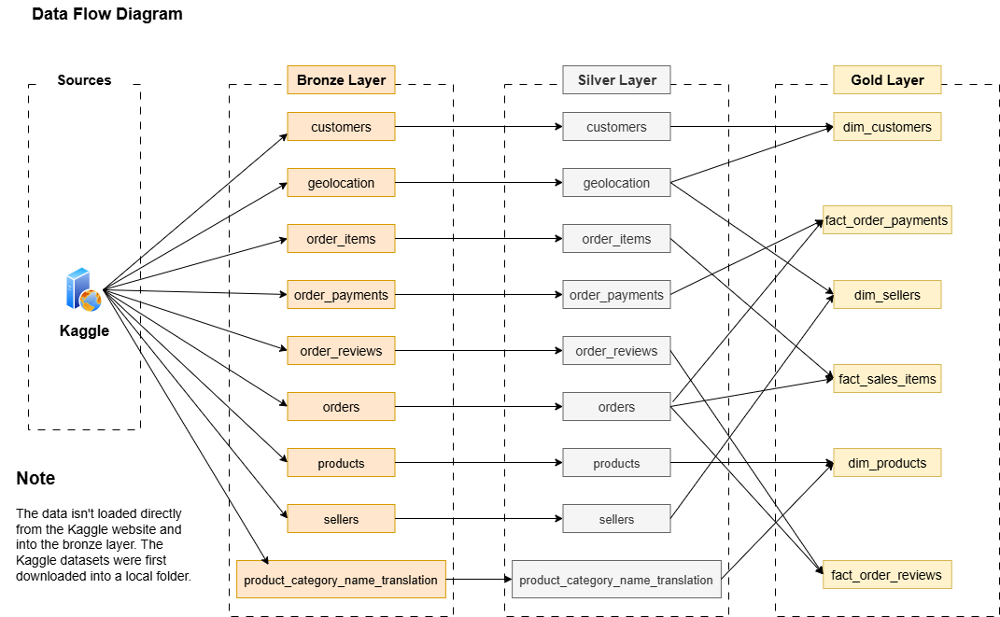
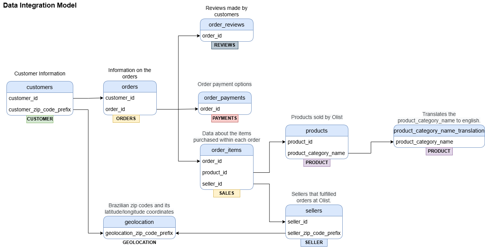
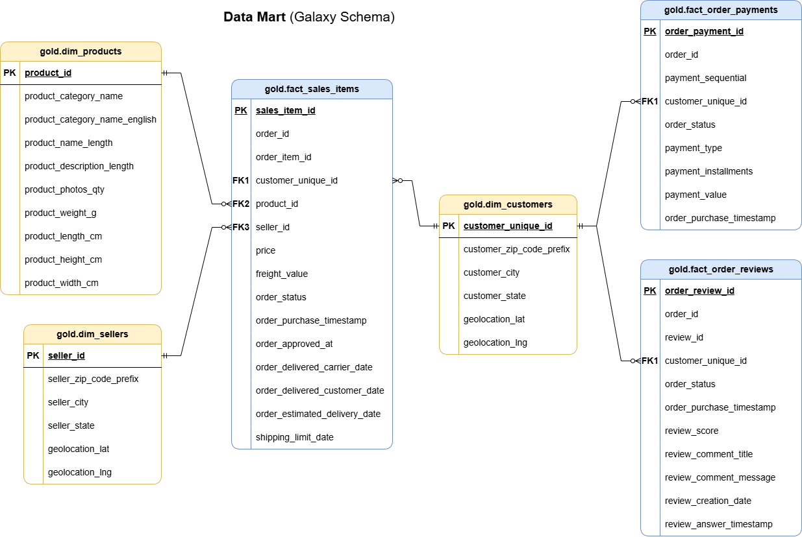

### 🌐 [English](README.md) | [Deutsch](README.de.md) | [Svenska](README.sv.md)

# Olist Brazilian E-Commerce Data Warehouse Project
Let's goo! This is a data engineering project that demonstrates a comprehensive data warehousing solution, involving the building of a data warehouse that will help data analysts with finding actionable insights in data. The data used for this project comes from the Brazilian E-Commerce store, "Olist".

---

## Table of Contents

1. [Project Requirements](#project-requirements)
2. [Data Architecture](#data-architecture)
3. [Bronze Layer](#bronze-layer)
4. [Silver Layer](#silver-layer)
5. [Gold Layer](#gold-layer)
6. [Repository Structure](#repository-structure)
7. [Clone the Repository](#clone-the-repository)
8. [License & Acknowledgments](#license--acknowledgments)
9. [About Me](#about-me)

---

## Project Requirements

### Building the Data Warehouse (Data Engineering)

#### Objective
Develop a modern data warehouse using SQL Server to consolidate sales and orders data, enabling analytical reporting and informed decision-making.

#### Specifications
- **Data Sources**: Import data from Kaggle's [Brazilian E-Commerce Public Dataset by Olist](https://www.kaggle.com/datasets/olistbr/brazilian-ecommerce/data) provided as CSV files.
- **Data Quality**: Cleanse and resolve data quality issues prior to analysis.
- **Integration**: Create a single, user-friendly data model designed for analytical queries.
- **Scope**: Focus on the latest dataset only; historization of data is not required.
- **Documentation**: Provide clear documentation of the data model to support both business stakeholders and analytics teams.

#### Naming Conventions
Specific naming conventions have been followed in order to standardize file and table names. More details are provided [here](docs/naming_conventions.md).

---

## Data Architecture

The data architecture for this project follows Medallion Architecture **Bronze**, **Silver**, and **Gold** layers:


## **Bronze Layer**

The Bronze layer stores raw data exactly as received from the source files.

No transformations are performed during ingestion.

The data is loaded directly from CSV files into SQL Server using the `BULK INSERT` command through the `bronze.load_bronze` stored procedure.

Bronze scripts can be found in

```
scripts/bronze
```

Data flow



## **Silver Layer** 

The Silver layer focuses on data cleansing, standardization, and normalization.

Key transformations include

* Removing redundant customer identifiers
* Correcting incorrect column names
* Replacing NULL values with meaningful defaults
* Standardizing payment types
* Aggregating duplicate geolocation records
* Deduplicating customer records
* Creating one record per unique customer

Comprehensive validation queries were also created to verify

* Duplicate keys
* Missing values
* Invalid dates
* Data consistency

Silver scripts

```
scripts/silver
```

Quality checks

```
tests/data_quality_check_silver.sql
```

Data integration model




## **Gold Layer**

The Gold layer contains business ready analytical models following a Galaxy Schema.

The warehouse consists of three dimension tables

* Customers
* Products
* Sellers

and three fact tables

* Sales Items
* Order Payments
* Order Reviews

These views are optimized for analytical reporting while preserving referential integrity across the warehouse.

Gold scripts

```
scripts/gold
```

Quality checks

```
tests/data_quality_check_gold.sql
```

Data Catalog

```
docs/data_catalog.md
```

Galaxy Schema



---

## Repository Structure
```
Olist-Brazilian-E-Commerce-Data-Warehouse-Project/
│
├── datasets/                           # Raw datasets used for the project
│
├── docs/                               # Project documentation and architecture details
│   ├── Data_Architecture               # Draw.io file shows the project's architecture
│   ├── data_catalog.md                 # Catalog of datasets, including field descriptions and metadata
│   ├── Data_Flow_Diagram               # Draw.io file for the data flow diagram
│   ├── Data_Model                      # Draw.io file for data models (galaxy schema)
│   ├── naming-conventions.md           # Consistent naming guidelines for tables, columns, and files
│
├── scripts/                            # SQL scripts for ETL and transformations
│   ├── bronze/                         # Scripts for extracting and loading raw data
│   ├── silver/                         # Scripts for cleaning and transforming data
│   ├── gold/                           # Scripts for creating analytical models
│
├── tests/                              # Test scripts and quality files
│
├── README.md                           # Project overview and instructions
├── LICENSE                             # License information for the repository
```

## Clone the repository

```bash
git clone https://github.com/Molo-M/Olist-Brazilian-E-Commerce-Data-Warehouse-Project.git
```

---

## License & Acknowledgments

This project is licensed under the [MIT License](LICENSE). 

## About Me

Hi there! I'm **Molo Munyansanga**. I’m an IT professional and passionate data enthusiast who loves working with data.

Let's stay in touch! Feel free to connect with me on: 

[](https://www.linkedin.com/in/molomunyansanga/)
